# Let's make a Android Barchart

In this first tutorial, we'll use data2viz to display a bar chart 
in a Android application using **data2viz** library. 

>This tutorial is data2viz version of [D3JS Let’s Make a Bar Chart](https://bost.ocks.org/mike/bar/).


This tutorial will help you understand how to:

1. set the gradle build for a data2viz Android project,
1. wrap a viz inside a Android application,
1. use basic visual components like rectangle, text, colors, group.
1. introduce `Scale` functions.

### What you'll need?

- 15 minutes
- JDK 1.8
- Java or Kotlin knowledge
- Android SDK. Minimum version is 19
- Emulator or device. Minimum version is Android 4.4 (19)
- Intellij Community/Ultimate with Android plugins or Android Studio (tested with Android Studio 3.4.1)

## Creating a new project

From Android Studio, we start a new Android Studio project using wizard.

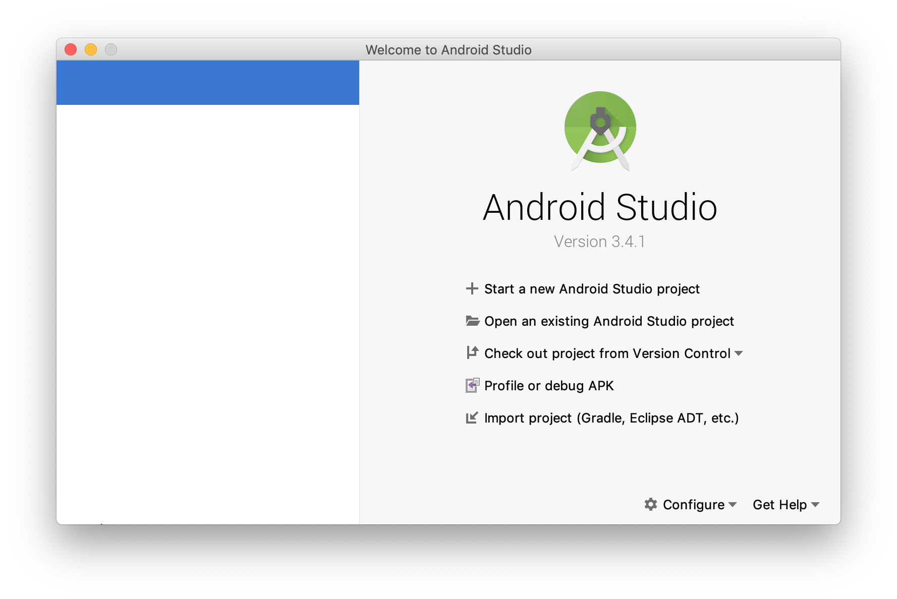

Let's start with `Empty Activity` template

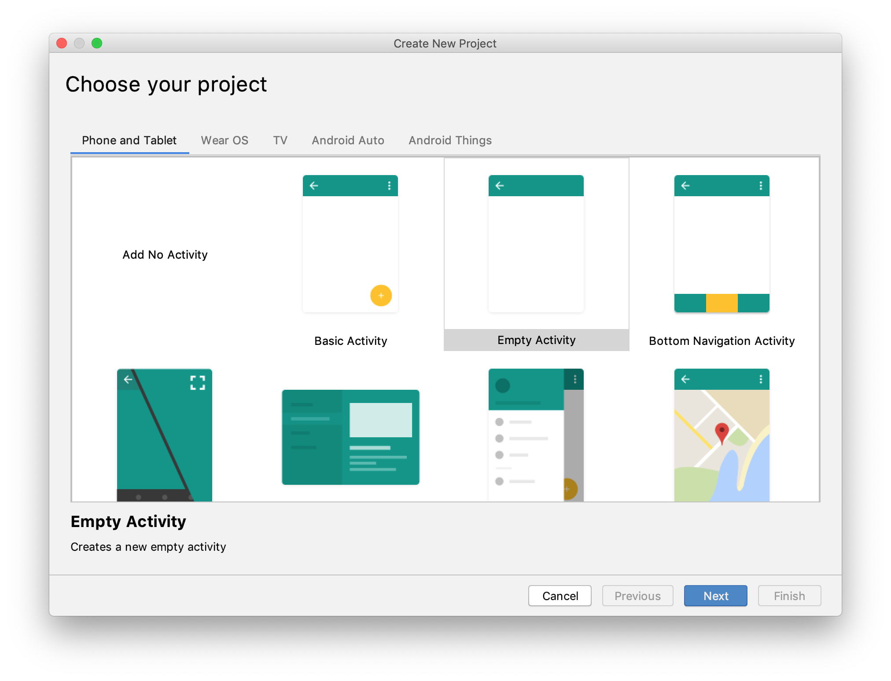

Project settings:

- You can choose any `Name`, `Package name` and `Save Location`
- `Language` may be Java or Kotlin. data2viz and this tutorial uses **Kotlin** but you can easy use Kotlin code from Java
- data2viz supports `Minimum API Level` from **Android 4.4 (API 19)**. You can use any API version above or equal API 19. You will need Android SDK installed for selected version.

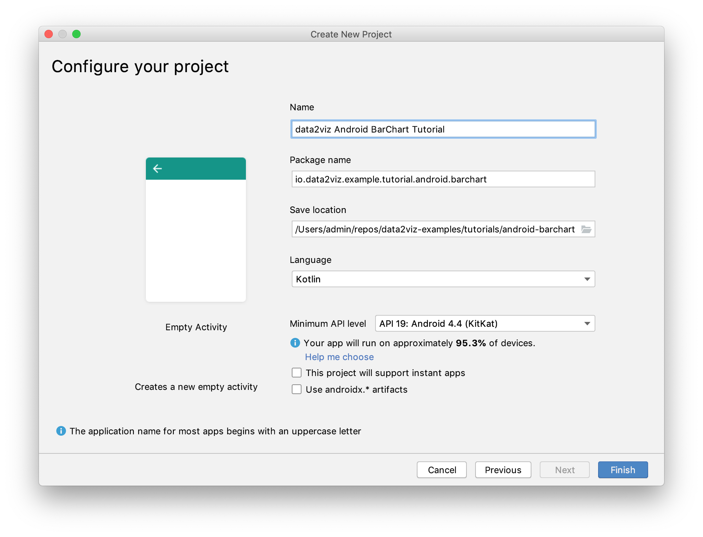

Depending on your environment, IntelliJ may then load the version of gradle configured 
in the `gradle/wrapper/gradle-wrapper.properties` file. 

Android Studio will automatically generate `MainActivity.kt` and related files.

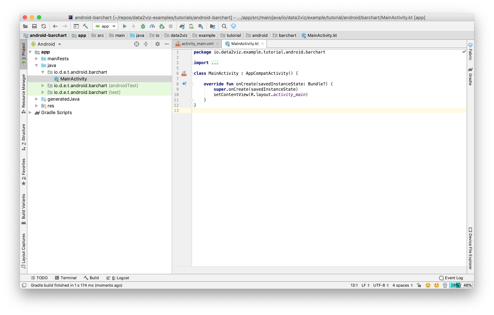

## Start a Android application

You can test Android App in two ways:

- connect **Android device** via USB (with enabled [Developer mode](https://developer.android.com/studio/debug/dev-options)).
- create and run **Android emulator** from `Tools -> AVD Manager`. You can learn more about [run app on emulator](https://developer.android.com/studio/run/emulator)

Make sure that your device Android version is version equal or above value you specified in `Minimum API Level` in previous steps. data2viz supports Android from API 19 (4.4)

You can read more about running app at [official documentation website](https://developer.android.com/training/basics/firstapp/running-app).


You can build & run `HelloWorld` demo by clicking on the green triangle 
on the left gutter of the editor.

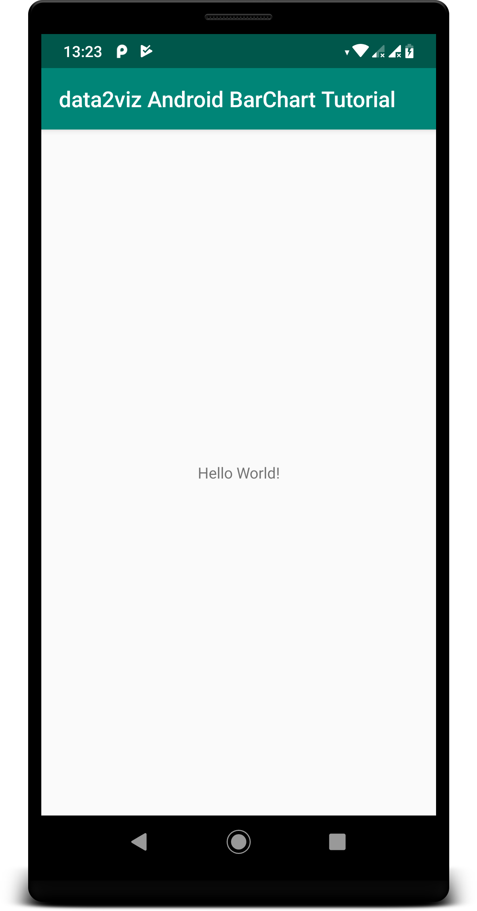

If you have more than one connected device/emulator you will see 


## Add a visualization

It's time now to start data2viz code. First, we have to add a 
dependency on data2viz library (`implementation "io.data2viz:d2v-data2viz-android:0.7.2-RC1"`) in `app` module `gradle.build` file:

```groovy
...
dependencies {
    ...
    androidTestImplementation 'com.android.support.test.espresso:espresso-core:3.0.2'
    // You should add below line
    implementation "io.data2viz:d2v-data2viz-android:0.7.2-RC1"
}
```

Actually, you can find file `gradle.build` in `$project/app/gradle.build` but Android Studio 3.4 display it under `Gradle Scripts -> build.gradle (Module:app)` in Android Project view.

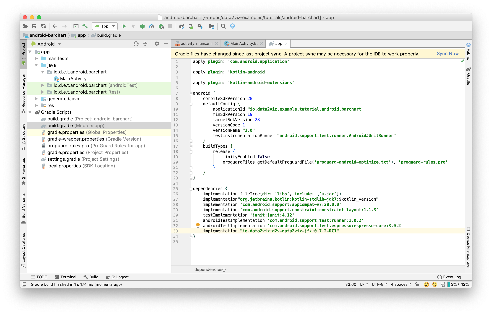

Android Studio proposes to `Import Changes`, and we accept it by 
clicking on the link. 

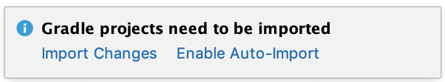

The library is then automatically downloaded. 

Now, we can add `data2viz` code. Let's create the `createViz` function in `MainActivity.kt`:

```kotlin
private fun createViz(): Viz = viz {
    rect {
        width = 50.0
        height = 50.0
        fill = Colors.Web.blueviolet
    }
}
```

And modify `MainActivity` method `onCreate()`. Instead of using view from `R.layout.activity_main` xml file you should set Viz as content view. 

```kotlin
    override fun onCreate(savedInstanceState: Bundle?) {
        super.onCreate(savedInstanceState)
//      setContentView(R.layout.activity_main)
        setContentView(createViz().toView(this))
    }
```


We also add the needed imports.

```kotlin
import android.os.Bundle
import android.support.v7.app.AppCompatActivity
import io.data2viz.color.Colors
import io.data2viz.viz.Viz
import io.data2viz.viz.toView
import io.data2viz.viz.viz
```

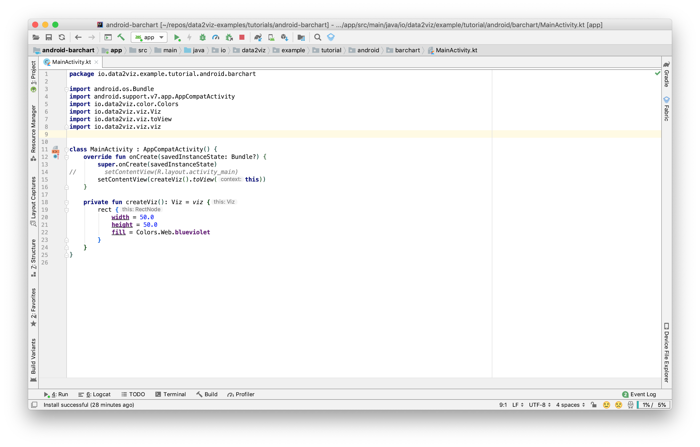

Launching the application, we have this result:

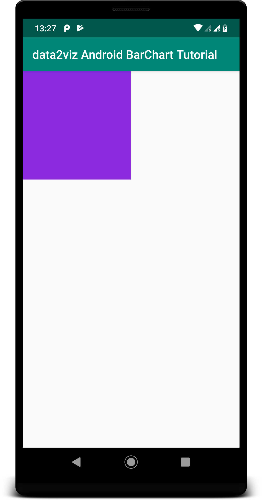

Kudos, we have our first visualization! But how it's 
working, what did we do? 

We create Android view with `Canvas` from data2viz `viz` object and add it as content view to Activity:
```kotlin
        setContentView(createViz().toView(this))
```
`data2viz` draws a memory visualization on a canvas. 
We need that canvas in the targeted platform. 

We then have defined the visualization. We create it 
by calling the `viz` function. 

This function takes a lambda that starts the data2viz 
DSL. Inside this lambda, we have access to available 
functions of `viz`. `rect` is a function call that 
creates a rectangle and takes a rectangle configuration 
lambda that allow us to define the properties of this 
rectangle: its width, height and fill color.

data2viz use all power of Kotlin. So you can create `viz` views in declarative way in Kotlin like in upcomming [Jetpack Compose](https://developer.android.com/jetpack/compose).

Currently it is not possible to add data2viz view in `.xml` layout file. You can only create empty FrameContainer and add data2viz view to it from code.

## Displaying data as a bars

So let's say we have this data defined as a global value:

```kotlin
val data = listOf(4, 8, 15, 16, 23, 42)
```

We define two more constants:

```kotlin
const val barHeight = 14.0
const val padding = 2.0
```

And add method to calculate screen width in `dp`

```kotlin
private fun calculateDisplayWidthInDp(): Double {
    val display = windowManager.defaultDisplay
    val outMetrics = DisplayMetrics()
    display.getMetrics(outMetrics)

    val density = resources.displayMetrics.density
    val dpWidth = outMetrics.widthPixels / density
    return dpWidth.toDouble()
}
```

Note: all size values in Android version of data2viz should be set in `dp` dimension

We are now iterating on the data using index to create a rectangle
for each of it and adding a text representing its value.

```kotlin
private fun createViz(): Viz = viz {
    width = calculateDisplayWidthInDp()

    data.forEachIndexed { index, datum ->
        group {
            transform {
                translate(
                    x = padding,
                    y = padding + index * (padding + barHeight) )
            }
            rect {
                width = 5.0 * datum
                height = barHeight
                fill = Colors.Web.steelblue
            }
            text {
                textContent = datum.toString()
                hAlign = TextHAlign.RIGHT
                vAlign = TextVAlign.HANGING
                x = datum * 5.0 - padding
                y = 1.5
                textColor = Colors.Web.white
                fontSize = 10.0
            }
        }
    }
}
```

We use a group to add a translation for each value, adding a `x` padding and moving 
on the `y` from the height of the bar plus a padding.

It produces the following result:

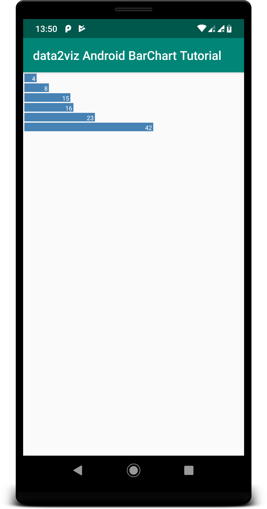

In this first version, we used a fixed ratio of 5.0 to define the width of the bar. 
It was ok, because we knew the max value of data and 5.0 * maxValue was still inside
the viz bounds. But, we can do better to have an automatic scaling without knowing
data.

For that, we introduce a `Scale` that will manage the ratio to keep the bars exactly
in the bounds of the viz:

```kotlin
val xScale = Scales.Continuous.linear {
    domain = listOf(.0, data.max()!!.toDouble())
    range = listOf(.0, width- 2 * padding)
}
```

This code creates a `Scale` that maps the domain values [0..42] to the wanted widths [0.0 .. `screenWidth`].
We can use this scale in the visualization code to set the expected width of the bar, and position 
of the text:

````kotlin
 private fun createViz(): Viz = viz {
    width = calculateDisplayWidthInDp()

    val xScale = Scales.Continuous.linear {
        domain = listOf(.0, data.max()!!.toDouble())
        range = listOf(.0, width- 2 * padding)
    }

    data.forEachIndexed { index, datum ->
        group {
            transform {
                translate(
                    x = padding,
                    y = padding + index * (padding + barHeight) )
            }
            rect {
                width = xScale(datum)           //<- now using scale for bar width
                height = barHeight
                fill = Colors.Web.steelblue
            }
            text {
                textContent = datum.toString()
                hAlign = TextHAlign.RIGHT
                vAlign = TextVAlign.HANGING
                x = xScale(datum) - 2.0        //<- and also for positioning text
                y = 1.5
                textColor = Colors.Web.white
                fontSize = 10.0
            }
        }
    }

}
````
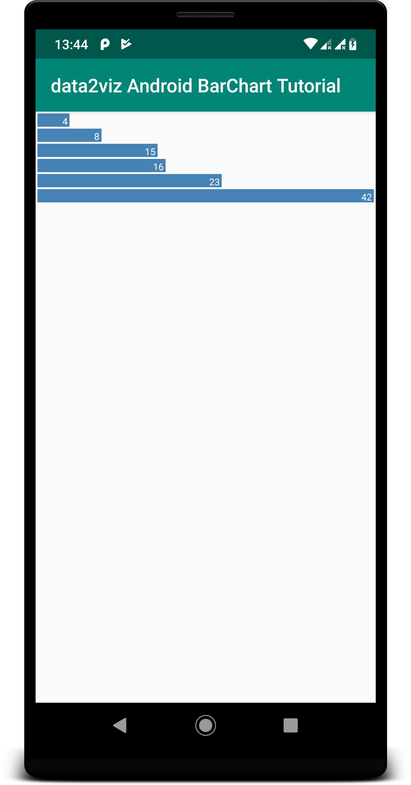

Great, you now know how to create a data2viz project in a Android application. 
It's an essential first step because it's the most comfortable 
environment to test and debug data visualization.

You can find the complete code of this project on 
[our data2viz examples repository](https://github.com/data2viz/data2viz-examples/blob/master/tutorials/android-barchart/).


If you have any suggestion, request, or feedback, please feel free 
to post a comment [on the forum](https://forum.data2viz.io/t/data2viz-documentation/96)
 or create a pull request on this project.
